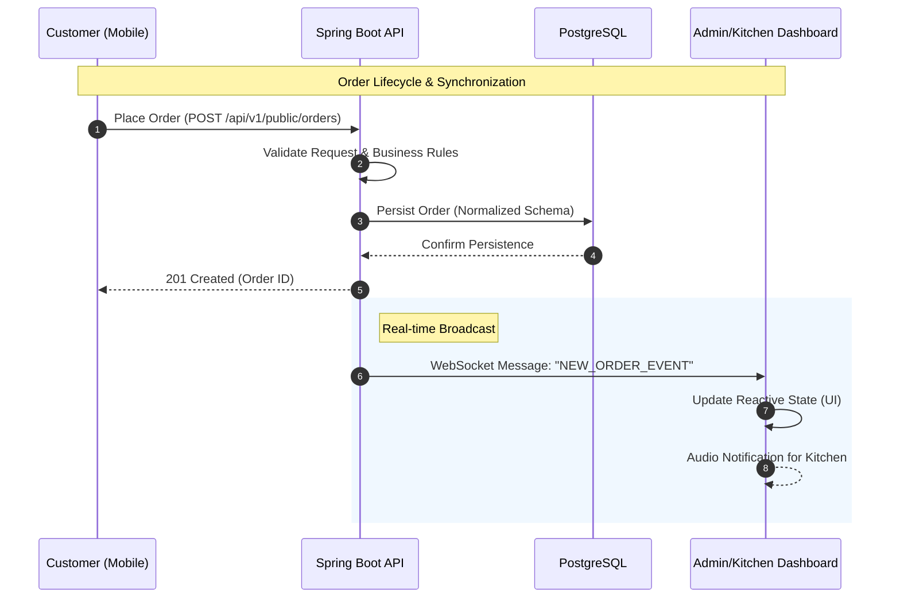

  

  

<h3 align="center">
  3rd-year IT Student at Vietnam-Korea University (VKU) 🎓
</h3>

  
  

  
  
  

---

  

### 👨‍💻 Philosophy

I am a Backend|Fullstack future development deeply passionate about designing **robust, scalable, and maintainable systems**.  My focus extends far beyond writing code that "just works."

- **System-Centric Focus:** I specialize in Java & Spring Boot, prioritizing clean architecture and domain-driven design.
- **Performance Optimization:** Experienced in mitigating bottlenecks, handling concurrency, and modeling database schemas for complex variations (e.g., in F&B systems).
- **Event-Driven Architectures:** Skilled in building real-time flows using WebSockets and designing asynchronous data pipelines.
- **Continuous Learning:** Actively expanding my expertise in Microservices, containerization (Docker), and DevOps practices.

💡 **My Goal:** Not just ship features, but understand why the system is designed this way.

---

### 🛠️ Core Stack & Tools

| **Domain** | **Technologies** |
| :--- | :--- |
| ⚙️ **Core Backend** |    |
| 🗄️ **Data & Cache** |     |
| 🐳 **DevOps & API** |     |
| 🌐 **Frontend Basics**|    |

---

### 🏗️ Engineering Case Studies

#### [QROS — QR Ordering System](https://github.com/lequochuy05/order_by_qr) `In Development`
> A full-stack restaurant operations platform with QR ordering, real-time kitchen workflows, payments, inventory, and analytics.

- **System Context:** Customers scan a table QR code to browse the menu, place orders, and track service status while staff operate tables, kitchen, payments, inventory, vouchers, and reports from the management dashboard.
- **Technical Challenges Solved:**
  - **Real-time Operations:** Built STOMP WebSocket and SockJS flows to synchronize new orders and status changes across customer, kitchen, and management interfaces.
  - **Security & Data Integrity:** Implemented JWT authentication, HTTP-only refresh cookies, role-based access control, PostgreSQL persistence, and Flyway migrations.
  - **Platform Integrations:** Integrated Redis caching, PayOS payments, Cloudinary image storage, Gemini AI recommendations, SMTP, and Prometheus metrics.
- **Tech Stack:** `Java 21` `Spring Boot` `PostgreSQL` `Redis` `WebSocket` `JWT` `React` `Docker`

🔍 <b>View System Architecture (Real-time Flow)</b>

**Key Architectural Decisions:**
- **Why WebSockets?** Enables event-driven order and kitchen updates without requiring clients to continuously poll the backend.
- **Relational Integrity:** PostgreSQL and Flyway keep menu, combo, order, inventory, voucher, and user data consistent as the schema evolves.
- **State Management:** The backend acts as the single source of truth and broadcasts order state transitions to connected interfaces.

---

#### [Onix — Shoes Shop](https://github.com/lequochuy05/Onix) `Completed`
> An end-to-end sneaker e-commerce platform with a native Android customer app and a Spring Boot web dashboard for administrators.

- **Technical Challenges Solved:**
  - **Mobile Architecture:** Built the Android application with Kotlin, MVVM, XML, and Jetpack Compose for product browsing, cart, wishlist, checkout, and order tracking.
  - **Commerce Integrations:** Used Firebase Realtime Database, Cloudinary, Retrofit, and ZaloPay Sandbox to support data synchronization, media, networking, and payments.
  - **Administration:** Developed a Spring Boot and Thymeleaf dashboard for product, inventory, order, and revenue management.
- **Tech Stack:** `Kotlin` `Android SDK` `Jetpack Compose` `MVVM` `Java` `Spring Boot` `Firebase Realtime Database`

---

#### [Hotel Management System](https://github.com/lequochuy05/HotelManagement) `Completed`
> A responsive hotel booking and administration system for managing rooms, reservations, facilities, guests, reviews, and invoices.

- **Technical Challenges Solved:**
  - **Booking Workflow:** Implemented room availability filtering, reservation management, booking status tracking, and customer reviews.
  - **Administration:** Built a dedicated admin panel for rooms, facilities, bookings, user queries, reviews, and PDF records.
  - **Authentication & Notifications:** Added separate customer and administrator authentication flows with SendGrid email support.
- **Tech Stack:** `PHP 8` `MySQL` `JavaScript` `Bootstrap` `HTML/CSS`

---

### 📊 GitHub Analytics

  

    
  

  
<b>👉 Click to view my Languges</b>

   
  

    
  

  
<b>👉 Click to view my Trophies</b>

   

  

---

### 📬 Contact Me
## 🤝 Let's Build Something Together
I am looking for a **Backend|Fullstack internship** opportunity to contribute to a real-world system and learn from senior engineers.

📧 wuchuy05.dev@gmail.com  
Available from: [June 2026]

---

## 🐍 My Snake

